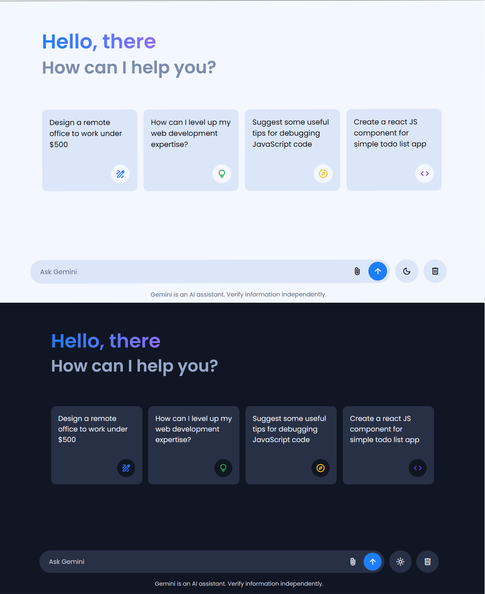

# Gemini - Chatbot

Gemini is an AI-powered chatbot that interacts with users, providing responses based on user inputs. It supports text and file inputs, simulates typing effects, and offers a dark/light theme toggle.

## Screenshots

## Live Preview 🚀
[Click Here](https://jyotroops.github.io/gemini-clone/)

## Features

- **Text Input**: Users can type their queries and receive responses from the chatbot.
- **File Upload**: Users can upload images, PDFs, text, and CSV files to enhance their queries.
- **Typing Simulation**: The chatbot simulates typing effects for a more realistic interaction.
- **Theme Toggle**: Users can switch between dark and light themes.
- **Suggestions**: Predefined suggestions are available for quick queries.
- **Chat History**: Maintains a history of the conversation.
- **Abort Response**: Users can stop the chatbot's response generation.
- **Delete Chats**: Users can clear the chat history.

## Technologies Used

- **HTML**: Structure of the web page.
- **CSS**: Styling of the web page.
- **JavaScript**: Functionality and interactivity.
- **Google Fonts**: Icons and fonts.

## Usage

1. Type your query in the input box and press the send button.
2. Optionally, upload a file to include in your query.
3. Use the theme toggle button to switch between dark and light themes.
4. Click on predefined suggestions to quickly send queries.
5. Use the stop button to abort the chatbot's response.
6. Clear the chat history using the delete button.